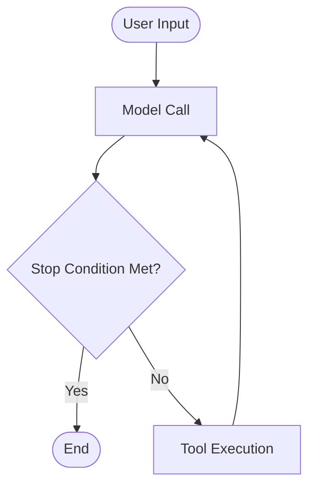

# agent.cpp

Building blocks for agents in C++.

## Building Blocks

We define an `agent` with the following building blocks:

- [Agent Loop](./#agent-loop)
- [Callbacks](./#callbacks)
- [Instructions](./#instructions)
- [Model](./#model)
- [Tools](./#tools)

```cpp
#include "agent.h"
#include "model.h"
#include "tool.h"

int main() {
    // Load a GGUF model
    auto model = agent_cpp::Model::create("model.gguf");

    // Define tools the agent can use
    std::vector<std::unique_ptr<agent_cpp::Tool>> tools;
    tools.push_back(std::make_unique<CalculatorTool>());

    // Create the agent
    agent_cpp::Agent agent(
        std::move(model),
        std::move(tools),
        {},  // callbacks (optional)
        "You are a helpful assistant."  // instructions
    );

    // Run the agent loop
    std::vector<common_chat_msg> messages = {
        {"user", "What is 42 * 17?"}
    };
    std::string response = agent.run_loop(messages);
}
```

## Agent Loop

In the current LLM (Large Language Models) world, and `agent` is usually a simple loop that intersperses `Model Calls` and `Tool Executions`, until a stop condition is met:



There are different ways to implement the stop condition.
By default we let the agent decide by generating an output *without* tool executions.
You can implement additional stop conditions via callbacks.

### Callbacks

Callbacks allow you to hook into the agent lifecycle at specific points:

- `before_agent_loop` / `after_agent_loop` - Run logic at the start/end of the agent loop
- `before_llm_call` / `after_llm_call` - Intercept or modify messages before/after model inference
- `before_tool_execution` / `after_tool_execution` - Validate, skip, or handle tool calls and their results

Use callbacks for logging, context manipulation, human-in-the-loop approval, or error recovery.

### Instructions

A system prompt that defines the agent's behavior and capabilities. Passed to the `Agent` constructor and automatically prepended to conversations.

### Model

Encapsulates LLM initialization and inference using [llama.cpp](https://github.com/ggml-org/llama.cpp). Handles:

- Loading GGUF model files
- Chat template application and tokenization
- Text generation with configurable sampling (temperature, top_p, top_k, etc.)
- KV cache management for efficient prompt caching

### Tools

Tools extend the agent's capabilities beyond text generation. Each tool defines:

- **Name and description** - Helps the model understand when to use it
- **Parameters schema** - JSON Schema defining expected arguments
- **Execute function** - The actual implementation

When the model decides to use a tool, the agent parses the tool call, executes it, and feeds the result back into the conversation.

## Examples

Check instructions for building and running:

- [Context Engineering](./examples/context-engineering/README.md)
    Use `callbacks` to manipulate the context between iterations of the agent loop.

- [Memory](./examples/memory/README.md)
    Use `tools` that allow an agent to store and retrieve relevant information across conversations.

- [Shell execution with human-in-the-loop](./examples/shell/README.md)
    Allow an agent to write shell scripts to perform multiple actions at once instead of calling separate `tools`.
    Use `callbacks` for human-in-the-loop interactions.

- [Tracing with OpenTelemetry](./examples/tracing/README.md)
    Use `callbacks` to collect a record of the steps of the agent loop.

### Shared Utilities

The [examples/shared](./examples/shared) directory contains reusable components used across multiple examples:

| File | Description |
|------|-------------|
| `calculator_tool.h` | A simple calculator tool for basic math operations (add, subtract, multiply, divide). Demonstrates how to implement a `Tool` with JSON Schema parameters. |
| `chat_loop.h` | Interactive chat loop that reads user input from stdin and prints agent responses. Handles colored output for TTY terminals. |
| `error_recovery_callback.h` | Callback that converts tool errors into JSON results, allowing the agent to see errors and retry gracefully instead of crashing. |
| `logging_callback.h` | Callback that logs tool calls and their results to stderr. Useful for debugging and understanding agent behavior. |
| `prompt_cache.h` | Utilities for building and caching the agent's system prompt tokens. Speeds up startup by reusing cached KV state. |

## Usage

**Requirements:** C++17 or higher.

### Option 1: FetchContent (Recommended)

The easiest way to integrate agent.cpp into your CMake project:

```cmake
include(FetchContent)
FetchContent_Declare(
    agent-cpp
    GIT_REPOSITORY https://github.com/mozilla-ai/agent.cpp
    GIT_TAG main  # or a specific release tag like v0.1.0
)
FetchContent_MakeAvailable(agent-cpp)

add_executable(my_app main.cpp)
target_link_libraries(my_app PRIVATE agent-cpp::agent)
```

### Option 2: Installed Package

Build and install agent.cpp, then use `find_package`:

```bash
# Clone and build
git clone --recursive https://github.com/mozilla-ai/agent.cpp
cd agent.cpp
cmake -B build -DAGENT_CPP_INSTALL=ON -DCMAKE_BUILD_TYPE=Release
cmake --build build

# Install (use --prefix for custom location)
cmake --install build --prefix ~/.local/agent-cpp
```

Then in your project:

```cmake
# If installed to a custom prefix, tell CMake where to find it
list(APPEND CMAKE_PREFIX_PATH "~/.local/agent-cpp")

find_package(agent-cpp REQUIRED)

add_executable(my_app main.cpp)
target_link_libraries(my_app PRIVATE agent-cpp::agent)
```

### Option 3: Git Submodule

Add agent.cpp as a submodule and include it directly:

```bash
git submodule add https://github.com/mozilla-ai/agent.cpp agent.cpp
git submodule update --init --recursive
```

```cmake
add_subdirectory(agent.cpp)
target_link_libraries(my_app PRIVATE agent-cpp::agent)
```

### Hardware Acceleration

This project uses [llama.cpp](https://github.com/ggml-org/llama.cpp) as a submodule. You can enable hardware-specific acceleration by passing the appropriate CMake flags when building. For example:

```bash
# CUDA (NVIDIA GPUs)
cmake -B build -DGGML_CUDA=ON

# OpenBLAS (CPU)
cmake -B build -DGGML_BLAS=ON -DGGML_BLAS_VENDOR=OpenBLAS
```

For a complete list of build options and backend-specific instructions, see the [llama.cpp build documentation](https://github.com/ggml-org/llama.cpp/blob/master/docs/build.md).
